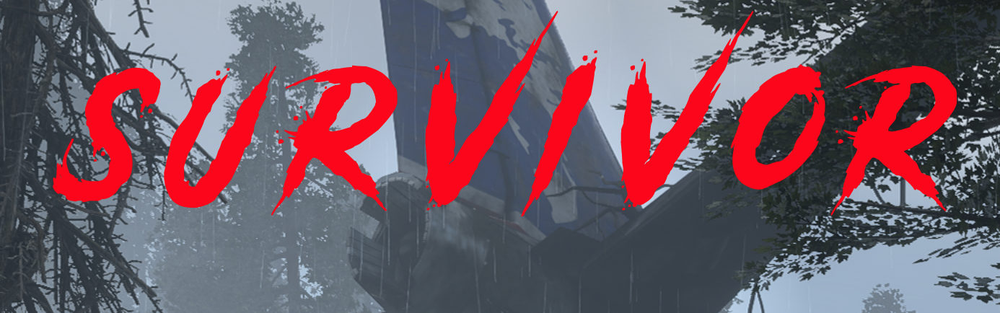
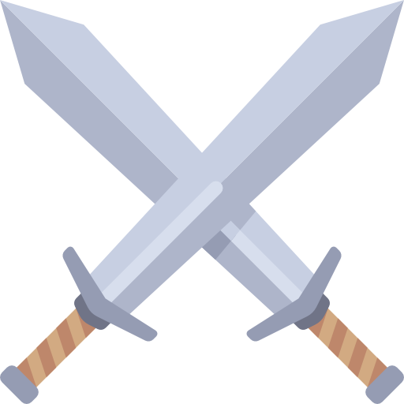

# Survivor: A Text-Based Story Game 

This is a text-based story game following the adventure of the only survivor of a plane crash. He is dazed and confused but able to gather a hatchet, zippo and two energy bars from the scraps after the crash. He must be able to survive throughout the days and nights by setting up camp, staying fed and gathering enough firewood to start a signal fire to be saved. 

## Gameplay Objective

The player must be able to survive and gather enough wood to create a signal fire. You are started off with 60 health, 30 hunger, a zippo lighter, a hatchet and your energy levels are quite scarce. Player must gather 10 pieces of wood without their hunger or health dropping to 0. Majority of actions require the use of wood so think carefully about which actions you choose to do. If you're unable to gather enough wood to create a signal fire by the 5th day, you will die. 

## Technologies Used

JavaScript used to write the functionality. 
HTML to create divs to hold the upper and lower game buttons as well as the game text container.
CSS to style.

## Challenges 

I had a hard time trying to connect the functions with each other to make sure things are running correctly all while updating the game information and keeping in mind once health or hunger levels drop the game is over. Another challenge was setting up if the player is out chopping trees, they have a chance to run into a rabbit and then attack but only the attack option is available IF the chance to attack a rabbit is available.

## How To Play

The player starts out with 60 health, hunger level of 50 and 5 energy. If you're unable to get saved by the 5th day, all hope is lost.

You are able to hover over each game icon to see what clicking it will do.

Starting a campfire costs 1 wood. 
 
Starting a signal fire requires 10 wood. 
 
Cooking costs 1 wood and requires raw meat. 
 
Sleeping costs 1 wood and increases your hunger by 10 but provides you with energy. 
 
Eating decreases your hunger by 50, increases healthpoints by 30 and provides you with 5 energy. 
 
You can only attack if you come across a rabbit whilst chopping a tree. It's a random chance. Otherwise, the attack option is useless. 
 
Chopping trees for wood uses 1 energy and gives you a chance to be succesful. 

### Sources Used

